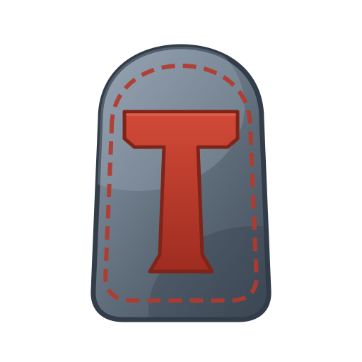

<div align="center">



# Torvik

**A self-hosting, compiled, general-purpose programming language**

[](https://github.com/torvik-lang/torvik/releases)
[](LICENSE)
[]()
[]()

**[torvik-lang.github.io](https://torvik-lang.github.io)** — the Torvik website

```torvik
df main() -> void {
    echo!("Hello from Torvik!");
}
```

</div>

---

## What is Torvik?

Torvik is a compiled, statically-typed, general-purpose language with a clean,
Norse-inspired keyword set (`df`, `check`, `whilst`, `each`, `guard`, `echo!`, `rune`). It
compiles to native binaries through LLVM — emitting LLVM IR that is linked with `clang` — so
there is no virtual machine and no garbage collector.

**Highlights:**

- **Native compilation** via an LLVM backend — real executables, no runtime VM.
- **Self-hosting** — the Torvik compiler (`torvc`) and package manager (`rune`) are both
  written in Torvik.
- **Automatic reference counting** — deterministic memory management, no GC, no manual frees.
- **A small, sharp type system** — integers `i8`–`i64`, `u8`–`u64`, the wide `i128`/`u128`,
  `f64`, `bool`, `str`, the `list`, `table`, and `bag` collections, `result<T>` for
  explicit error handling, and **`aett`** — enumerations named for the rune families,
  with exhaustiveness-checked **`when`** pattern matching.
- **A compiler that talks to you** — clean located errors for every invalid program, and
  a warnings system (unused variables, unreachable code, deprecations) that never fails
  a build and can be tuned per file with `!@` directives.
- **Concurrency without data races** — spawn tasks with **`raven`**, pass values between
  them over typed **`bridge`** channels. Values copy as they cross a thread boundary, so
  tasks share no mutable state and the model is safe by construction.
- **`rune` project tool** — create, build, and run projects with one command.
- **Proven on real software** — [Vefna](https://github.com/torvik-lang/vefna), a parallel
  static site generator, is written entirely in Torvik (the
  [Torvik website](https://torvik-lang.github.io) is woven with it).

---

## Install

Install the latest release with one command — it places `torvc` and `rune` in your Torvik
home, fetches the runtime and standard library, and adds Torvik to your `PATH`.

**Linux:**

```sh
curl -fsSL https://raw.githubusercontent.com/torvik-lang/torvik/main/linux/install.sh | sh
```

**Windows** (PowerShell):

```powershell
iwr -useb https://raw.githubusercontent.com/torvik-lang/torvik/main/windows/install.ps1 | iex
```

You also need `clang` installed — Torvik uses it as its linker and back-end:
`sudo eopkg install clang` on Solus, `sudo apt install clang` on Debian/Ubuntu.
On Windows you need a clang that bundles the MinGW-w64
headers/libraries — [LLVM-MinGW](https://github.com/mstorsjo/llvm-mingw/releases) (simplest),
MSYS2 (`pacman -S mingw-w64-clang-x86_64-toolchain`), or [WinLibs](https://winlibs.com) — on
`PATH` (plain LLVM alone lacks the C headers). Then open a new
terminal (restart your shell or run `. ~/.bashrc` on Linux) and confirm with
`rune --version`. Rune manages Torvik from there — `rune update` upgrades it and
`rune uninstall` removes it.

**macOS:** not yet supported. Official macOS builds (with a tested installer) are planned for
a future version, once real Apple hardware is available for credible testing. There's no
prebuilt binary today, so the installer will stop with a note if run on macOS. The toolchain is written to be macOS-compatible and can be built from source by the
adventurous (needs clang via `xcode-select --install`), but this is untested — if you want a
supported setup now, run Torvik on Linux, including in a Linux VM or container.

**Supported platforms:**

| Platform            | Architecture | Status                        |
|---------------------|--------------|-------------------------------|
| Linux               | x86_64       | Supported                     |
| Windows             | x86_64       | Supported                     |
| macOS               | x86_64 / arm | Not yet — future version      |

> Torvik is 64-bit only.

---

## Sponsors

Torvik is free, open-source software, built and maintained independently. If Torvik is
useful to you, consider [sponsoring its development](https://buymeacoffee.com/torviklang)
— several tiers include having your name or logo featured right here for each month you
sponsor.

### This month's sponsors

*Your name or logo could be here — become a
[monthly sponsor](https://buymeacoffee.com/torviklang) and help keep the forge burning.*

## Contributors

Torvik grows with its community. Contributors who land work in a given month are recognized
here for that month — bug reports that lead to fixes count too.

### This month's contributors

*Your name could be here — check the open issues, or bring a fix of your own.*

---

## Update

Already have Torvik? Update the toolchain in place with:

```sh
rune update
```

This re-runs the official installer for your platform (Linux/macOS or Windows), refreshing
`torvc`, `rune`, the runtime, and the standard library — your projects, config, and PATH
setup are untouched. Re-run with `rune update --yes` to skip the confirmation. Check what
you're running with `rune version`.

To install a **specific version** instead of the latest, pass it:

```sh
rune update v1.1.0     # exactly 1.1.0
rune update v1.0       # the newest 1.0.x release
rune update v1         # the newest 1.x release
```

A project can also require a minimum Torvik version via a `torvik = "1.1.0"` line in its
`torvik.rune`; `rune build`/`run` will tell you to update if your toolchain is too old. See
the [Toolchain guide](docs/TOOLING.md) for details.

You can also just re-run the install one-liner for your platform (above); it has the same
effect.

---

## Quick start

```bash
# Create and run a project
rune new myapp
cd myapp
rune run
```

Or compile a single file directly:

```bash
torvc hello.tv -o hello
./hello
```

---

## A taste of the language

```torvik
df factorial(n: i64) -> i64 {
    check n <= 1 { return 1; }
    return n * factorial(n - 1);
}

df classify(n: i64) -> str {
    guard n != 0 fallback { return "zero"; }
    return n > 0 ?> "positive" !> "negative";
}

df main() -> void {
    each i in 1..6 {
        set f: i64 = factorial(i);
        echo!("{i}! = {f}");
    }

    set scores: table<str, i64> = table_new();
    table_set(scores, "Freya", 10);
    set freya: i64 = table_get(scores, "Freya");
    echo!("Freya: {freya}");

    echo!(classify(-7));
}
```

---

## Documentation

Check out our **[Wiki page](https://github.com/torvik-lang/torvik/wiki)** for more info regarding Torvik. You can also read docs in the source below.

- **[The Torvik website](https://torvik-lang.github.io)** — the language at a glance, install, and a tour.
- **[The Torvik Guide](docs/GUIDE.md)** — full tutorial and language reference.
- **[Tooling](docs/TOOLING.md)** — the `torvc` compiler and the `rune` project tool.
- **[Standard library](docs/STDLIB.md)** — built-in function reference.

---

## Toolchain

| Tool    | Purpose                      |
|---------|------------------------------|
| `torvc` | Compiler                     |
| `rune`  | Project & build tool         |

```bash
torvc myfile.tv -o myfile     # compile
torvc myfile.tv --final       # production build
rune new myapp                # create a project
rune build                    # compile the project
rune run                      # compile and run
```

---

## Self-hosting

Torvik compiles itself. The compiler and package manager are written entirely in Torvik
(`.tv`) source under `src/`, and a Torvik binary rebuilds them — there is no other language
in the bootstrap. A clean self-rebuild reproduces the compiler bit-for-bit.

---

## License

Torvik is licensed under the **GNU AGPL-3.0** with a runtime-library exception, so programs
you write in Torvik are entirely your own and carry no license obligation from the compiler.
See [LICENSE](LICENSE) for the full text.
